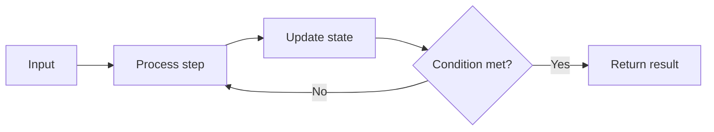

| Platform | Difficulty | Topic | Language | Time Complexity | Space Complexity |
| :--- | :--- | :--- | :--- | :--- | :--- |
| LeetCode (inferred from filename pattern). | Not determined from repository contents. | Recursion / Bit Logic | Java | O(log n) | O(log n) |

# Number of Steps to Reduce a Number to Zero
> Solve the stated task by applying a suitable data-structure or algorithmic strategy reflected in the provided Java implementation.

## 🧩 Problem Statement
The repository contains a Java solution for **Number of Steps to Reduce a Number to Zero**. From the implementation, the objective is to compute the required output for the given input structure while preserving correctness for standard edge scenarios.

Problem-specific constraints and official platform wording are **not determined from repository contents**.

## 💡 Core Concept & Intuition
The implementation is primarily based on **Recursion / Bit Logic**.

### Why This Concept?
This approach keeps the solution aligned with expected interview-quality trade-offs between correctness and runtime efficiency.

### Intuition
1. Start from the most direct interpretation of the input/output behavior.
2. Observe where a naive scan or repeated work would become inefficient.
3. Use **Recursion / Bit Logic** to avoid redundant operations.
4. Return the final computed answer after a single structured pass or bounded iterative refinement.

## 🔍 Visual Explanation

## 🚀 Approach: Brute Force vs. Optimized
### 🐢 Brute Force
A straightforward baseline would check combinations or states more exhaustively, which increases repeated computation.

- **Time Complexity:** Not determined from repository contents.
- **Space Complexity:** Not determined from repository contents.
- **Scalability issue:** Repeated checks do not scale well for larger input sizes.

### 🚀 Optimized Solution
The included Java solution applies **Recursion / Bit Logic** and computes the result with:

- **Time Complexity:** O(log n)
- **Space Complexity:** O(log n)

## 👣 Step-by-Step Walkthrough
1. Read the input and initialize required variables/data structures.
2. Iterate according to the implemented strategy.
3. Update state (indices, counters, accumulators, or helper structures) based on each element or condition.
4. Continue until the termination condition in the code is met.
5. Return the computed result.

## 🎤 Interview Perspective
### What Is the Interviewer Testing?
- Data-structure selection and algorithmic modeling.
- Ability to optimize beyond naive approaches.
- Clarity in complexity analysis and reasoning.

### Edge Cases
- Empty or minimal input size.
- Duplicate or repeated values when relevant.
- Boundary indices / off-by-one conditions.
- Input-specific corner cases implied by control flow.

### Common Mistakes
- Mishandling initialization and boundary conditions.
- Incorrect state updates leading to missed cases.
- Returning too early or too late in iterative/recursive logic.

### Possible Follow-Up Questions
- Can space usage be reduced further?
- Can this be solved with a different data structure?
- What changes for streaming or very large inputs?

## 📊 Complexity Analysis
| Approach | Time Complexity | Space Complexity |
| :--- | :--- | :--- |
| Brute Force | Not determined from repository contents. | Not determined from repository contents. |
| Optimized | O(log n) | O(log n) |

### 💻 Solution
[View Java Solution](./solution.java)

## 📌 Key Takeaways
- This solution demonstrates practical use of **Recursion / Bit Logic**.
- Correct boundary handling is as important as algorithm choice.
- Complexity awareness is central to interview-quality solutions.
- Readable control flow improves maintainability and reviewability.

## 🔗 Related Problems
- [Pow(x, n)](../050-pow-x-n/)
- [Fibonacci Number](../509-fibonacci-number/)
- [Recursion](../recursion/)
