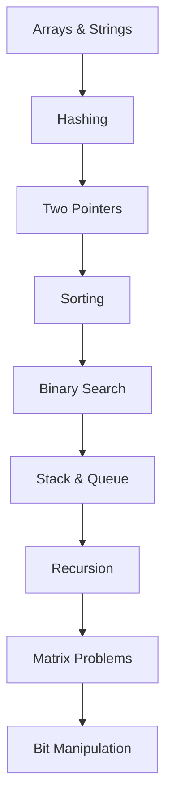

# 🧠 DSA, LeetCode & SQL Problem-Solving Portfolio

This repository is a structured collection of algorithm and data-structure practice solutions written in Java. It is organized to showcase practical problem-solving, complexity trade-offs, and communication quality for interview and recruiter review.

## 🚀 Skills Demonstrated
- **Array**
- **Binary Search**
- **Binary Search Partition**
- **Binary Search on Answer**
- **Bit Manipulation**
- **Conditionals**
- **Control Flow**
- **Cyclic Sort**
- **Hash Map**
- **Hash Set**
- **Hashing**
- **Java Fundamentals**
- **Linear Search**
- **Math**
- **Matrix**
- **Prefix Sum**
- **Queue**
- **Recursion**
- **Sorting**
- **Stack**
- **String**
- **Two Pointers**
- **Complexity Analysis**
- **Interview-Oriented Problem Solving**
- **Readable and Maintainable Code Structure**

## 📊 Repository Statistics
| Category | Count |
| :--- | ---: |
| Total Problems | 54 |
| Easy | 0 |
| Medium | 0 |
| Hard | 0 |
| Difficulty Not Determined | 54 |
| SQL | 0 |

## 📚 Topic Distribution
| Topic | Problems |
| :--- | ---: |
| Binary Search | 6 |
| Two Pointers | 4 |
| Cyclic Sort | 3 |
| Sorting | 3 |
| Binary Search on Answer | 2 |
| Bit Manipulation | 2 |
| Java Fundamentals | 2 |
| Math | 2 |
| Recursion | 2 |
| Stack | 2 |
| String | 2 |
| Array | 1 |
| Array / Math | 1 |
| Binary Search / Recursion | 1 |
| Binary Search Partition | 1 |
| Conditionals | 1 |
| Control Flow | 1 |
| Hash Map | 1 |
| Hash Set | 1 |
| Hash Set / String | 1 |
| Hashing / Array | 1 |
| Linear Search / String | 1 |
| Math / Binary Search | 1 |
| Matrix / Array | 1 |
| Matrix / Binary Search Strategy | 1 |
| Matrix / Linear Scan | 1 |
| Prefix Sum | 1 |
| Queue / Stack | 1 |
| Recursion / Bit Logic | 1 |
| Recursion / Fast Power | 1 |
| Sorting / Array | 1 |
| Stack / Queue | 1 |
| String / Hashing | 1 |
| Two Pointers / Sorting | 1 |
| Two Pointers / String | 1 |

## 📈 Difficulty Distribution
| Difficulty | Count |
| :--- | ---: |
| 🟢 Easy | 0 |
| 🟡 Medium | 0 |
| 🔴 Hard | 0 |
| ⚪ Not determined from repository contents. | 54 |

## 🗂️ Problem Index
| # | Problem | Difficulty | Topic | Language | Solution |
| :--- | :--- | :--- | :--- | :--- | :--- |
| 001 | Two Sum | Not determined from repository contents. | Hash Map | Java | [View](./001-two-sum/) |
| 125 | Valid Palindrome | Not determined from repository contents. | Two Pointers / String | Java | [View](./125-valid-palindrome/) |
| 1295 | Find Numbers with Even Number of Digits | Not determined from repository contents. | Array / Math | Java | [View](./1295-find-numbers-with-even-number-of-digits/) |
| 013 | Roman to Integer | Not determined from repository contents. | String / Hashing | Java | [View](./013-roman-to-integer/) |
| 1342 | Number of Steps to Reduce a Number to Zero | Not determined from repository contents. | Recursion / Bit Logic | Java | [View](./1342-number-of-steps-to-reduce-a-number-to-zero/) |
| 137 | Single Number II | Not determined from repository contents. | Bit Manipulation | Java | [View](./137-single-number-ii/) |
| 1480 | Running Sum of 1d Array | Not determined from repository contents. | Prefix Sum | Java | [View](./1480-running-sum-of-1d-array/) |
| 015 | 3Sum | Not determined from repository contents. | Two Pointers / Sorting | Java | [View](./015-3sum/) |
| 153 | Find Minimum in Rotated Sorted Array | Not determined from repository contents. | Binary Search | Java | [View](./153-find-minimum-in-rotated-sorted-array/) |
| 154 | Find Minimum in Rotated Sorted Array | Not determined from repository contents. | Binary Search | Java | [View](./154-find-minimum-in-rotated-sorted-array/) |
| 162 | Find Peak Element | Not determined from repository contents. | Binary Search | Java | [View](./162-find-peak-element/) |
| 1662 | Check If Two String Arrays are Equivalent | Not determined from repository contents. | String | Java | [View](./1662-check-if-two-string-arrays-are-equivalent/) |
| 1929 | Concatenation of Array | Not determined from repository contents. | Array | Java | [View](./1929-concatenation-of-array/) |
| 020 | Valid Parentheses | Not determined from repository contents. | Stack | Java | [View](./020-valid-parentheses/) |
| 2089 | Find Target Indices After Sorting Array | Not determined from repository contents. | Sorting / Array | Java | [View](./2089-find-target-indices-after-sorting-array/) |
| 2235 | Add Two Integers | Not determined from repository contents. | Math | Java | [View](./2235-add-two-integers/) |
| 225 | Implement Stack using Queues | Not determined from repository contents. | Stack / Queue | Java | [View](./225-implement-stack-using-queues/) |
| 232 | Implement Queue using Stacks | Not determined from repository contents. | Queue / Stack | Java | [View](./232-implement-queue-using-stacks/) |
| 240 | Search a 2D Matrix II | Not determined from repository contents. | Matrix / Binary Search Strategy | Java | [View](./240-search-a-2d-matrix-ii/) |
| 026 | Remove Duplicates from Sorted Array | Not determined from repository contents. | Two Pointers | Java | [View](./026-remove-duplicates-from-sorted-array/) |
| 268 | Missing Number | Not determined from repository contents. | Hashing / Array | Java | [View](./268-missing-number/) |
| 344 | Reverse String | Not determined from repository contents. | Two Pointers | Java | [View](./344-reverse-string/) |
| 349 | Intersection of Two Arrays | Not determined from repository contents. | Hash Set | Java | [View](./349-intersection-of-two-arrays/) |
| 3760 | Maximum Substrings With Distinct Start | Not determined from repository contents. | Hash Set / String | Java | [View](./3760-maximum-substrings-with-distinct-start/) |
| 004 | Median of Two Sorted Arrays | Not determined from repository contents. | Binary Search Partition | Java | [View](./004-median-of-two-sorted-arrays/) |
| 041 | First Missing Positive | Not determined from repository contents. | Cyclic Sort | Java | [View](./041-first-missing-positive/) |
| 410 | leetcode | Not determined from repository contents. | Binary Search on Answer | Java | [View](./410-leetcode/) |
| 448 | Find All Numbers Disappeared in an Array | Not determined from repository contents. | Cyclic Sort | Java | [View](./448-find-all-numbers-disappeared-in-an-array/) |
| 050 | Pow(x, n) | Not determined from repository contents. | Recursion / Fast Power | Java | [View](./050-pow-x-n/) |
| 509 | Fibonacci Number | Not determined from repository contents. | Recursion | Java | [View](./509-fibonacci-number/) |
| 058 | Length of Last Word | Not determined from repository contents. | String | Java | [View](./058-length-of-last-word/) |
| 069 | Sqrt(x) | Not determined from repository contents. | Math / Binary Search | Java | [View](./069-sqrt-x/) |
| 704 | Binary Search | Not determined from repository contents. | Binary Search | Java | [View](./704-binary-search/) |
| 074 | Search a 2D Matrix | Not determined from repository contents. | Binary Search | Java | [View](./074-search-a-2d-matrix/) |
| 075 | Sort Colors | Not determined from repository contents. | Two Pointers | Java | [View](./075-sort-colors/) |
| 875 | Koko Eating Bananas | Not determined from repository contents. | Binary Search on Answer | Java | [View](./875-koko-eating-bananas/) |
| 088 | Merge Sorted Array | Not determined from repository contents. | Two Pointers | Java | [View](./088-merge-sorted-array/) |
| 009 | Palindrome Number | Not determined from repository contents. | Math | Java | [View](./009-palindrome-number/) |
| 912 | Sort an Array | Not determined from repository contents. | Sorting | Java | [View](./912-sort-an-array/) |
| N/A | Binary Search Recursion | Not determined from repository contents. | Binary Search / Recursion | Java | [View](./binary-search-recursion/) |
| N/A | BubbleSort in java | Not determined from repository contents. | Sorting | Java | [View](./bubblesort-in-java/) |
| N/A | Convert 1D Array Into 2D Array | Not determined from repository contents. | Matrix / Array | Java | [View](./convert-1d-array-into-2d-array/) |
| N/A | Find all the duplicates in array | Not determined from repository contents. | Cyclic Sort | Java | [View](./find-all-the-duplicates-in-array/) |
| N/A | Integer Caching in java | Not determined from repository contents. | Java Fundamentals | Java | [View](./integer-caching-in-java/) |
| N/A | Linear Search in char | Not determined from repository contents. | Linear Search / String | Java | [View](./linear-search-in-char/) |
| N/A | Multiple Statement | Not determined from repository contents. | Conditionals | Java | [View](./multiple-statement/) |
| N/A | Nums Comparisons | Not determined from repository contents. | Java Fundamentals | Java | [View](./nums-comparisons/) |
| N/A | Recursion | Not determined from repository contents. | Recursion | Java | [View](./recursion/) |
| N/A | Search Minimun Element in 2D arrays | Not determined from repository contents. | Matrix / Linear Scan | Java | [View](./search-minimun-element-in-2d-arrays/) |
| N/A | Selection Sort | Not determined from repository contents. | Sorting | Java | [View](./selection-sort/) |
| N/A | Single Number | Not determined from repository contents. | Bit Manipulation | Java | [View](./single-number/) |
| N/A | Stack | Not determined from repository contents. | Stack | Java | [View](./stack/) |
| N/A | SwitchCase in java | Not determined from repository contents. | Control Flow | Java | [View](./switchcase-in-java/) |
| N/A | agonstic binary search | Not determined from repository contents. | Binary Search | Java | [View](./agonstic-binary-search/) |

## 🧭 DSA Learning Roadmap

## 💼 Engineering & Interview Perspective
This portfolio demonstrates selecting appropriate data structures, improving over brute-force baselines, reasoning about time/space complexity, and communicating implementation decisions in a format suitable for technical interviews.

> Difficulty, official constraints, and platform metadata are only marked when reliably inferable from repository contents.

<!---LeetCode Topics Start-->
# LeetCode Topics
## Math
|  |
| ------- |
| [0231-power-of-two](https://github.com/Rohittt-Malviya/DSA-WITH-JAVA/tree/master/0231-power-of-two) |
## Bit Manipulation
|  |
| ------- |
| [0231-power-of-two](https://github.com/Rohittt-Malviya/DSA-WITH-JAVA/tree/master/0231-power-of-two) |
## Recursion
|  |
| ------- |
| [0231-power-of-two](https://github.com/Rohittt-Malviya/DSA-WITH-JAVA/tree/master/0231-power-of-two) |
<!---LeetCode Topics End-->